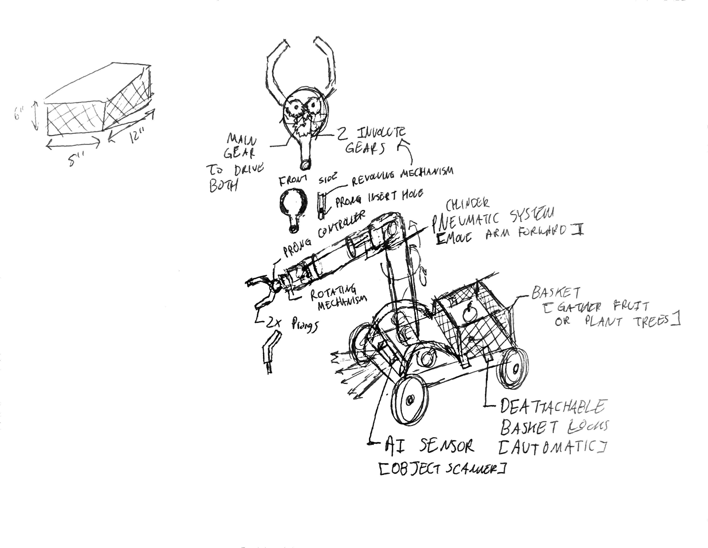

# Introducing... PicterGro

PicterGro is an automated robot to serve the Earth and the enviroment!
PicterGro was designed for a robot design challenge hosted by PTC Waterloo in the Robotics Rebooted event. 

# The Inital Ideas and Sketches

