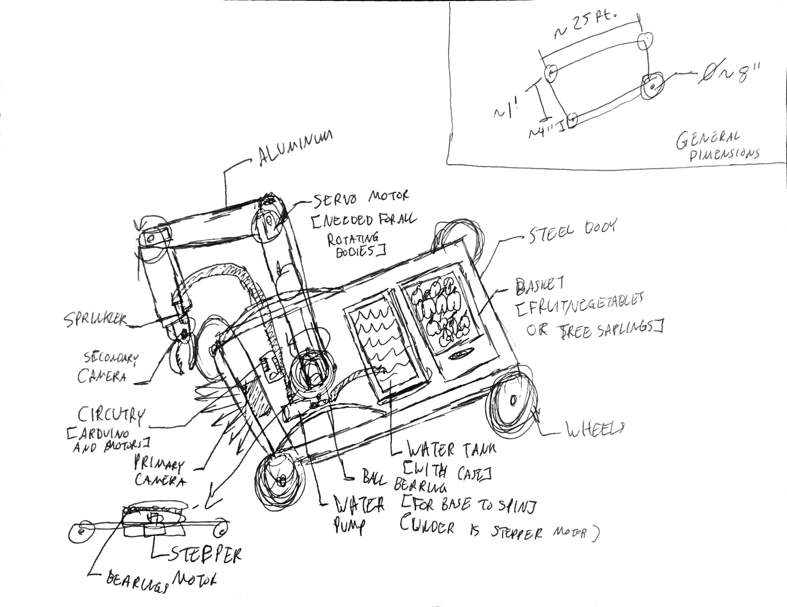

<link rel="preconnect" href="https://fonts.gstatic.com">
<link href="https://fonts.googleapis.com/css2?family=Roboto&display=swap" rel="stylesheet">

# Introducing PicterGro
PicterGro is an automated robot to serve the Earth and the enviroment!  
This was designed for a robot design challenge hosted by PTC Waterloo in the Robotics Rebooted event.  
This design took appoximately 10 hours to complete on Fusion 360, and PicterGro won first prize for the challenge!   

 
# How PicterGro works
There are 3 main functions of PicterGro:  
1. Picking fruit / vegetables / plants
2. Planting trees
3. Watering plants / trees

All of the functions are attached onto a huge robotic arm on a base made from sheet metal. A water tank and wooden    basket is put behind the arm. The water tank supplies water to the sprinkler that is attached by the gripper, which is made   possible by the water pump. The wooden basket is for the robot to put the vegetables or fruits, just like a farmer   would collect apples in a basket. Also, the wooden basket can be used to put tree seedlings which the robot will pick   it up and plant the tree. Everything is controlled on an online website, and everything is connected through the circuity and   an Arduino. The robot is accompanied by two cameras; a primary camera embedded within the sheet metal base   and a secondary camera that is above the gripper. Cameras will provide vision to the programs that use algorithms to identify   obstacles, create pathaways, and to see where the gripper is going. Finally, the mechanisms are all powered by servo motors   and a stepper motor. 
  
Interested in learning more?   Check out my slideshow that I made to present PicterGro!  
https://docs.google.com/presentation/d/1rZMRSgZxJUn-KpXbrpccTkQAfvvW1_FMM-mFlaCCQCU/edit?usp=sharing 

# PicterGro Mechanism and Website Demos
[Click on Thumbnails for YouTube Demo Videos]

 

  

# The Inital Ideas and Sketches

